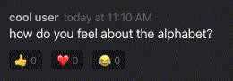

# Discord 2.0

Help! Through an unfortunate accident in our lab, we've lost all of the Discord code. We need your help to rebuild from scratch as quickly as possible!

The app and the backend are now written entirely in JavaScript, using React in the frontend and NodeJS for the backend. We've built an MVP with users, channels, and messages, but we need your help adding one of our favorite features — _message reactions_.

Please spend up to two hours implementing the frontend and backend for a message reaction feature. **Important** — when you're done, zip up this directory and submit it back to us. Please edit the last section of this README file with a short blurb telling us what tradeoffs you made and how you might improve your solution if you had more time.

## Task details

- Users should be able to react to any message with any of the following emojis: 👍 ❤️ 😂
- Users may react to a single message with more than one emoji, but only once per emoji — clicking on a reaction emoji should act like a toggle, so clicking on the same emoji twice should result in no reaction
- Each reaction should include the sum of users who reacted to the message with the given emoji (e.g. if five users reacted to a message with 👍, the UI should display `👍 5`)
- The reaction should indicate whether the current user has reacted with that emoji or not (through a different background color, or other means)
- Avoid introducing new, glaringly-obvious security vulnerabilities
- Architect your database changes assuming that this API will run in a distributed system with eventually-consistent databases — concurrent user reactions should be handled gracefully

## Example UI

## Running locally

- `yarn` — Installs dependencies
- `yarn start` — Starts the Webpack and Node servers
- `yarn client` — Starts the Webpack server
- `yarn server` — Starts the Node server

## Demo

I have recorded a video walkthrough [here](https://bit.ly/3ic4Skn).

## Tradeoffs

I have chosen to store reactions as a mapping of the userId to the list of emoji reactions the user reacted with for a message.
I traded space in this approach to avoid race conditions when updating the count for an emoji since we expect this API to run in a distributed system with eventually consistent database.
I batched together all the emojis a user may react with for a message to make it easy to support adding, removing, searching, and updating by user. A potential use case might be to support removal of a user's data for privacy or compliance. Performance can be improved by aggressive caching.
An alternative approach would have been to store the inverse mapping of each emojiId to the list of users that reacted with it for a message which would de-dupe the emojiIds. While it could be possible to use versionIds in database (coupled with storing emojis on Messages table itself) and address some race conditions, the above choice also made it easier to delete all data for a user if needed (eg GDPR).

To support the above model, I chose to expose an additional API to upsert a user's reactions to a given message. The client / app contains the logic to determine the final state of emojis a user may have for a given message. This can be extended to batch updates for a given message by a user to reduce chattiness. For example - when a user reacts to multiple emojis to a given message, the client / app can batch them together instead of making one update call per emoji.

## Follow-ups

If more time were available, I'd optimize fetching reactions on a per message basis to avoid the expense of filtering the reactions associated with each message on the server side.  
I'd invest in writing automated tests, and caching the emoji reactions to avoid network roundtrips.
As a follow-up I'd add a feature to display the list of users that reacted with an emoji upon hovering over an emoji button.
